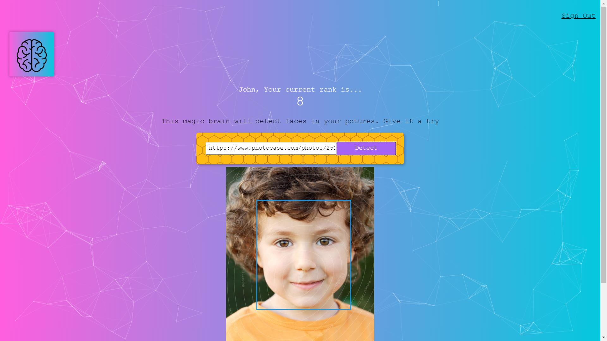

# Smart Brain

Smart Brain is a web app that uses the Clarifai API to locate a face in a picture. Using  React.js front-end and Node.js backend with Express.js as well as a PosrtgreSQL database to keep track of how many entries every user has made.

## Technologies Used

#### Front-End

* HTML5
* CSS3
* React.js

#### NPM Packages

Create React-APP

Tachyons

react-tilt

particle.js

Bcrypt

PostgreSQL

knex

body parser

cors

express

#### APIs

* [**Clarifai**](https://www.clarifai.com/)
* [Smart Brain API](https://github.com/mdammar786/SmartBrain-API)
